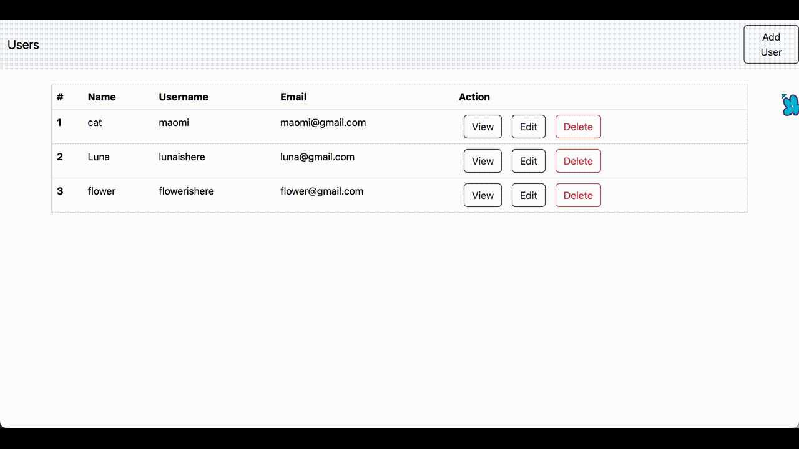

# User Management App

This project consists of a React frontend and a Spring Boot backend, providing a full-stack user management solution.

Preview for the user management website:



## Features

- React frontend built with modern JavaScript libraries and tools.
- Spring Boot backend providing RESTful APIs CRUD.
- Integration of frontend and backend for a seamless user experience.

## Technologies Used

### Frontend

- React.js, Vite
- Axios (for HTTP requests)
- React Router (for routing)
- Bootstrap (for styling)

### Backend

- Spring Boot
- Spring Data JPA, hibernate (for database access)
- MySQL (relational database)
- Maven (for dependency management)

## Getting Started

### Prerequisites

- Node.js
- npm
- Java Development Kit (JDK)
- Maven
- MySQL

### Installation

Clone the repository:

frontend:

```bash
git clone git@github.com:Fanpeng-L/fullstasck-springboot-test-frontend.git
```

backend:

```bash
git clone git@github.com:Fanpeng-L/fullstasck-springboot-test.git
```

### Usage

- Access the React frontend at http://localhost:5173
- Access the Spring Boot backend APIs at http://localhost:8080/users
